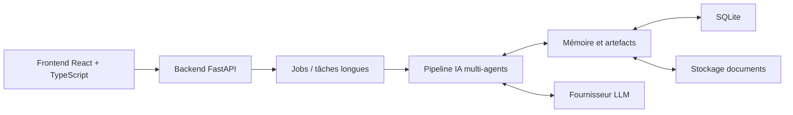
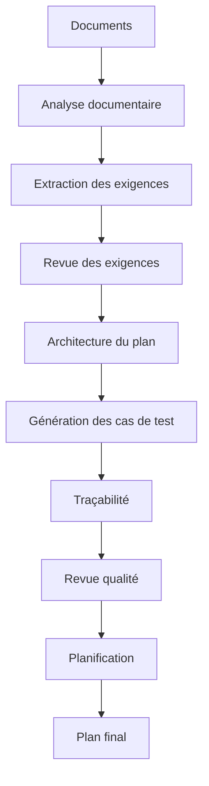
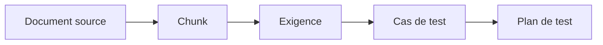

<div align="center">


# Documentation de l'application

## AI Test Plan Generator

### Projet métier

**Réalisé par :**  
Mohamed Taha El Younsi  
Amine Amllal

**Encadré par :**  
Pr. Tawfik Masrour  
Pr. Ibtissam Elhassani

**Établissement :**  
École Nationale Supérieure d'Arts et Métiers de Meknès  
Université Moulay Ismaïl

</div>

---

# Table des matières

1. [Présentation générale](#1-présentation-générale)
2. [Objectifs du projet](#2-objectifs-du-projet)
3. [Problématique métier](#3-problématique-métier)
4. [Fonctionnalités principales](#4-fonctionnalités-principales)
5. [Architecture générale](#5-architecture-générale)
6. [Architecture IA et pipeline multi-agents](#6-architecture-ia-et-pipeline-multi-agents)
7. [Gestion des documents et des exigences](#7-gestion-des-documents-et-des-exigences)
8. [Génération des plans de test](#8-génération-des-plans-de-test)
9. [Traçabilité et couverture](#9-traçabilité-et-couverture)
10. [Chatbot contextuel](#10-chatbot-contextuel)
11. [Planification et ressources](#11-planification-et-ressources)
12. [Sécurité, authentification et rôles](#12-sécurité-authentification-et-rôles)
13. [Suivi des coûts LLM et observabilité](#13-suivi-des-coûts-llm-et-observabilité)
14. [Technologies utilisées](#14-technologies-utilisées)
15. [Structure du projet](#15-structure-du-projet)
16. [Installation et lancement local](#16-installation-et-lancement-local)
17. [Configuration des variables d'environnement](#17-configuration-des-variables-denvironnement)
18. [Lancement avec Docker](#18-lancement-avec-docker)
19. [Compte de test](#19-compte-de-test)
20. [Guide d'utilisation](#20-guide-dutilisation)
21. [Livrables disponibles](#21-livrables-disponibles)
22. [Limites actuelles](#22-limites-actuelles)
23. [Perspectives d'amélioration](#23-perspectives-damélioration)
24. [Conclusion](#24-conclusion)

---

# 1. Présentation générale

**AI Test Plan Generator** est une application web destinée à assister les équipes qualité, validation et vérification dans la création de plans de test à partir de documents techniques.

L'application permet d'importer des documents de spécification, d'en extraire des exigences, de générer des plans de test et des cas de test, puis de vérifier la couverture entre les exigences et les tests générés.

Le projet ne se limite pas à une simple interface de discussion avec un modèle d'intelligence artificielle. Il s'agit d'une application complète comprenant :

- une interface web ;
- une API backend ;
- une base de données ;
- un système d'authentification ;
- un pipeline IA multi-agents ;
- une gestion documentaire ;
- une traçabilité entre documents, exigences et tests ;
- un chatbot contextuel ;
- un suivi des ressources, du planning et des coûts LLM.

---

# 2. Objectifs du projet

L'objectif principal du projet est de développer une plateforme capable d'assister la génération de plans de test techniques à partir de documents d'entrée.

Les objectifs fonctionnels sont les suivants :

- créer et gérer des projets ;
- importer des documents techniques ;
- analyser les documents importés ;
- extraire automatiquement des exigences ;
- générer des plans de test structurés ;
- générer des cas de test détaillés ;
- relier les tests aux exigences sources ;
- fournir une matrice de couverture ;
- permettre un échange avec un chatbot conscient du contexte du projet ;
- offrir un mode interactif de validation des étapes IA ;
- suivre les ressources et le planning de test ;
- fournir un socle extensible pour de futures améliorations produit.

---

# 3. Problématique métier

Dans de nombreux projets industriels ou logiciels, la préparation des plans de test est une tâche longue, manuelle et fortement dépendante de l'expertise humaine.

Les principales difficultés sont :

- les exigences sont souvent dispersées dans plusieurs documents ;
- les documents techniques peuvent être longs et complexes ;
- la création de cas de test est répétitive ;
- la traçabilité entre exigences et tests est difficile à maintenir ;
- les équipes doivent justifier la couverture des exigences ;
- les connaissances projet sont rarement capitalisées correctement ;
- les outils génériques d'IA ne conservent pas une structure projet fiable.

Le projet propose donc une solution orientée métier : utiliser l'IA pour accélérer la génération, tout en conservant une structure contrôlable, traçable et réutilisable.

---

# 4. Fonctionnalités principales

## 4.1 Gestion des projets

L'utilisateur peut créer des projets avec :

- un nom ;
- une description ;
- un secteur d'activité ;
- un budget mensuel LLM ;
- des membres et rôles ;
- des ressources de planification.

Le secteur d'activité permet d'adapter certains prompts et raisonnements de l'IA au contexte du projet.

## 4.2 Import de documents

L'application permet d'importer des documents techniques dans un projet. Les documents sont ensuite stockés, découpés en morceaux exploitables par l'IA, puis utilisés dans le pipeline d'extraction et de génération.

Formats prévus ou supportés selon l'implémentation :

- PDF ;
- DOCX ;
- Markdown ;
- texte ;
- fichiers techniques convertibles en texte.

## 4.3 Extraction des exigences

Après ingestion des documents, le système extrait des exigences structurées. Chaque exigence contient notamment :

- un identifiant ;
- un titre ;
- un type ;
- une priorité ;
- une formulation textuelle ;
- un lien vers le document source ;
- un ou plusieurs chunks sources.

## 4.4 Génération de plans de test

L'utilisateur peut générer un plan de test à partir :

- de toutes les exigences extraites ;
- d'une sélection d'exigences ;
- d'une réextraction depuis les documents sources.

Le plan généré peut inclure :

- un titre ;
- une introduction ;
- des objectifs ;
- un périmètre ;
- une stratégie de test ;
- des critères d'entrée et de sortie ;
- des risques ;
- des cas de test ;
- une matrice de couverture ;
- un planning si des ressources sont configurées.

## 4.5 Mode interactif

Le mode interactif permet à l'utilisateur de valider ou de corriger certaines étapes clés du pipeline :

- extraction des exigences ;
- architecture du plan ;
- génération des cas de test.

Ce mode permet de garder un contrôle humain sur les résultats produits par l'IA.

## 4.6 Chatbot contextuel

Le chatbot peut répondre aux questions liées au projet. Il utilise le contexte disponible :

- projet courant ;
- documents importés ;
- exigences extraites ;
- plans générés ;
- cas de test ;
- couverture ;
- historique récent de conversation.

---

# 5. Architecture générale

L'application repose sur une architecture full-stack.



## 5.1 Frontend

Le frontend est développé avec React et TypeScript. Il fournit les écrans principaux :

- page de connexion ;
- liste des projets ;
- tableau de bord projet ;
- documents ;
- exigences ;
- génération de plan ;
- détail du plan ;
- couverture ;
- chatbot ;
- ressources ;
- administration.

## 5.2 Backend

Le backend est développé avec FastAPI. Il expose les routes nécessaires à :

- l'authentification ;
- la gestion des projets ;
- l'import de documents ;
- la génération des plans ;
- le suivi des jobs ;
- le chatbot ;
- la traçabilité ;
- la planification ;
- l'administration et les coûts.

## 5.3 Stockage

En mode local, l'application utilise SQLite pour stocker :

- les utilisateurs ;
- les projets ;
- les documents ;
- les chunks ;
- les exigences ;
- les plans ;
- les cas de test ;
- les événements de chat ;
- les usages LLM ;
- les ressources et plannings.

Les fichiers uploadés sont stockés localement dans un dossier de blobs.

---

# 6. Architecture IA et pipeline multi-agents

L'IA du projet est organisée sous forme de pipeline multi-agents. Chaque agent possède une responsabilité spécifique.



## 6.1 Agents principaux

| Agent | Rôle |
|---|---|
| Document Analyst | Analyse le corpus documentaire et en extrait une vue globale |
| Requirement Extractor | Extrait les exigences depuis les chunks de documents |
| Requirement Reviewer | Vérifie la qualité des exigences extraites |
| Test Architect | Définit la structure globale du plan de test |
| Test Generator | Génère les cas de test détaillés |
| Traceability Agent | Relie les cas de test aux exigences |
| Reviewer | Vérifie la cohérence et la qualité du plan |
| Planner | Génère un planning si des ressources sont disponibles |
| Copilot Agent | Répond aux questions utilisateur dans le contexte du projet |

## 6.2 Pourquoi une approche multi-agents ?

Une approche multi-agents présente plusieurs avantages :

- meilleure séparation des responsabilités ;
- prompts plus ciblés ;
- débogage plus simple ;
- possibilité de réviser chaque étape ;
- meilleure lisibilité de la chaîne de génération ;
- possibilité d'ajouter ou remplacer un agent sans réécrire tout le système.

---

# 7. Gestion des documents et des exigences

## 7.1 Ingestion des documents

Lorsqu'un document est importé, le backend réalise plusieurs opérations :

1. sauvegarde du fichier ;
2. lecture du contenu ;
3. découpage en chunks ;
4. stockage des chunks ;
5. extraction des exigences ;
6. association des exigences au projet.

Les documents volumineux peuvent être traités via des jobs en arrière-plan afin d'éviter de bloquer l'interface utilisateur.

## 7.2 Chunks

Les chunks représentent des morceaux de documents suffisamment petits pour être utilisés dans les appels LLM et la recherche contextuelle.

Chaque chunk peut contenir :

- un identifiant ;
- un identifiant de document ;
- un texte ;
- un type ;
- des pages de début et de fin ;
- un nombre de tokens.

## 7.3 Exigences

Les exigences extraites servent de base à la génération des plans de test. Elles permettent de structurer la démarche et d'assurer la couverture.

---

# 8. Génération des plans de test

La génération d'un plan de test peut être lancée depuis l'interface projet.

L'utilisateur peut choisir :

- le niveau de détail ;
- le mode d'exigences ;
- le mode interactif ou automatique ;
- un objectif optionnel.

## 8.1 Objectif de génération

Le champ objectif permet d'orienter l'agent architecte.

Exemple utile :

> Générer un plan de test orienté validation de la sécurité et de l'authentification de l'API.

Si l'utilisateur ne renseigne pas d'objectif, l'application utilise un objectif par défaut :

> Générer un plan de test complet à partir des exigences du projet.

## 8.2 Résultat généré

Le résultat est un artefact `TestPlan` comprenant :

- informations générales ;
- objectifs ;
- périmètre ;
- stratégie ;
- risques ;
- critères d'entrée ;
- critères de sortie ;
- cas de test ;
- couverture ;
- planning éventuel.

---

# 9. Traçabilité et couverture

La traçabilité est un point central du projet.



Le système maintient les liens entre :

- les documents ;
- les morceaux de documents ;
- les exigences ;
- les cas de test ;
- les plans.

La couverture permet de répondre aux questions suivantes :

- quelles exigences sont couvertes ?
- quelles exigences ne sont pas encore couvertes ?
- quels cas de test couvrent une exigence donnée ?
- le plan généré couvre-t-il suffisamment le périmètre ?

---

# 10. Chatbot contextuel

Le chatbot n'est pas conçu comme une simple conversation générale. Il est intégré au contexte projet.

Il peut utiliser :

- l'identité du projet ;
- le secteur d'activité ;
- les documents importés ;
- les chunks retrouvés par recherche ;
- les exigences ;
- les plans générés ;
- les cas de test ;
- la couverture ;
- l'historique de conversation.

L'interface affiche un indicateur de contexte afin que l'utilisateur sache si le chatbot dispose bien des documents, exigences et plans du projet.

Exemples de questions :

- Quelles exigences ne sont pas couvertes par le dernier plan ?
- Quels tests devrions-nous ajouter pour améliorer la couverture ?
- Résume le périmètre du dernier plan de test.
- Quels risques ont été identifiés ?

---

# 11. Planification et ressources

Le module de ressources permet de définir des ressources de test disponibles pour le projet.

Une ressource contient :

- un nom ;
- un service ;
- un rôle ;
- un pourcentage de disponibilité.

Ces ressources sont utilisées par l'agent de planification afin de générer un planning et d'affecter des cas de test à des personnes ou services.

Cette fonctionnalité prépare le passage d'un simple générateur de documents vers un outil de suivi et d'exécution des tests.

---

# 12. Sécurité, authentification et rôles

L'application contient un système d'authentification basé sur :

- email ;
- mot de passe ;
- tokens JWT ;
- refresh tokens ;
- clés API ;
- rôles projet.

Les mots de passe sont hashés côté backend.

Les rôles projet permettent de préparer une séparation entre :

- propriétaire ;
- éditeur ;
- reviewer ;
- viewer.

En mode local ou démonstration, un compte administrateur peut être créé avec un script dédié.

---

# 13. Suivi des coûts LLM et observabilité

L'application suit les appels aux modèles de langage.

Les informations suivies peuvent inclure :

- modèle utilisé ;
- rôle du modèle ;
- tokens d'entrée ;
- tokens de sortie ;
- coût estimé ;
- projet associé ;
- session associée.

Ce suivi permet de contrôler l'utilisation des API externes et de préparer une gestion budgétaire par projet.

Le projet inclut également des éléments d'observabilité :

- logs structurés ;
- métriques Prometheus ;
- endpoints de santé ;
- support OpenTelemetry selon la configuration.

---

# 14. Technologies utilisées

## 14.1 Backend

- Python ;
- FastAPI ;
- Pydantic ;
- SQLite ;
- aiosqlite ;
- LiteLLM ;
- LangGraph ;
- NetworkX ;
- Redis / ARQ selon le mode de déploiement ;
- Prometheus / OpenTelemetry.

## 14.2 Frontend

- React ;
- TypeScript ;
- Vite ;
- TanStack Router ;
- TanStack Query ;
- Axios ;
- Tailwind CSS.

## 14.3 IA et stockage

- Modèles LLM configurables ;
- embeddings NVIDIA possibles ;
- mémoire sémantique en mémoire ou backend vectoriel ;
- graphe de traçabilité NetworkX ou Neo4j selon configuration ;
- stockage local ou S3 pour les documents.

---

# 15. Structure du projet

Structure simplifiée :

```text
ai-testplan-generator/
├── src/ai_testplan_generator/
│   ├── agents/          Agents IA spécialisés
│   ├── api/             Application FastAPI, routes, sécurité
│   ├── domain/          Repositories et logique métier
│   ├── graphs/          Graphes LangGraph
│   ├── ingestion/       Lecture, chunking, extraction
│   ├── jobs/            Tâches longues et workers
│   ├── llm/             Abstraction fournisseur LLM
│   ├── memory/          Mémoire, vector store, graphe
│   ├── models/          Modèles Pydantic
│   ├── pipelines/       Pipelines autonomes et interactifs
│   ├── quality/         Contrôles qualité
│   └── telemetry/       Coûts, métriques, logs
├── frontend/
│   ├── src/
│   │   ├── features/    Modules UI métier
│   │   ├── lib/         Client API et utilitaires
│   │   └── app/         Layout et routing
├── tests/               Tests backend
├── docker-compose.yml   Déploiement local Docker
├── README.md            Guide de lancement
├── .env.example         Configuration backend
└── frontend/.env.example Configuration frontend
```

---

# 16. Installation et lancement local

## 16.1 Prérequis

- Python 3.11 ou version compatible ;
- Node.js ;
- npm ;
- Git ;
- une clé API LLM selon le fournisseur utilisé ;
- éventuellement Docker pour le déploiement conteneurisé.

## 16.2 Installation backend

```bash
git clone <url-du-repository>
cd ai-testplan-generator

python -m venv .venv
source .venv/bin/activate

pip install -e .
cp .env.example .env
```

Éditer ensuite le fichier `.env` afin d'ajouter les clés nécessaires.

Lancer le backend :

```bash
uvicorn ai_testplan_generator.api.app:create_app --factory --port 8000
```

Si le port `8000` est déjà utilisé :

```bash
uvicorn ai_testplan_generator.api.app:create_app --factory --port 8001
```

Dans ce cas, il faut aussi adapter la configuration du frontend.

## 16.3 Installation frontend

```bash
cd frontend
npm install
cp .env.example .env
```

Vérifier que `frontend/.env` pointe vers le bon backend :

```env
VITE_API_BASE_URL=http://localhost:8000
VITE_WS_BASE_URL=ws://localhost:8000
```

Lancer le frontend :

```bash
npm run dev
```

Interface disponible par défaut :

```text
http://localhost:5173
```

---

# 17. Configuration des variables d'environnement

Le projet utilise des variables d'environnement pour configurer :

- les modèles LLM ;
- les clés API ;
- la base de données ;
- le stockage ;
- l'authentification ;
- les backends mémoire ;
- Redis ;
- l'observabilité.

## 17.1 Variables principales backend

| Variable | Description |
|---|---|
| `LLM_MODEL_SMART` | Modèle utilisé pour les tâches complexes |
| `LLM_MODEL_BALANCED` | Modèle utilisé pour les tâches intermédiaires |
| `LLM_MODEL_FAST` | Modèle utilisé pour les tâches rapides |
| `LLM_MODEL_EMBEDDING` | Modèle d'embedding |
| `NVIDIA_API_KEY` | Clé API NVIDIA si embeddings NVIDIA |
| `OPENAI_API_KEY` | Clé API OpenAI si utilisée |
| `ANTHROPIC_API_KEY` | Clé API Anthropic si utilisée |
| `GOOGLE_API_KEY` | Clé API Google si utilisée |
| `APP_DB_PATH` | Chemin de la base SQLite |
| `BLOB_STORE_LOCAL_ROOT` | Dossier local de stockage des documents |
| `JWT_SECRET` | Secret JWT en mode local |
| `REDIS_URL` | URL Redis si utilisée |
| `API_CORS_ORIGINS` | Origines autorisées |

## 17.2 Variables principales frontend

| Variable | Description |
|---|---|
| `VITE_API_BASE_URL` | URL de l'API backend |
| `VITE_WS_BASE_URL` | URL WebSocket backend |
| `VITE_OPENAPI_URL` | URL du schéma OpenAPI |

## 17.3 Services externes

Le projet peut utiliser des services externes :

- fournisseur LLM via LiteLLM ;
- NVIDIA embeddings ;
- Qdrant pour vector store ;
- Neo4j pour graphe de traçabilité ;
- Redis pour jobs et événements ;
- S3 pour stockage documents ;
- Prometheus, Grafana, Jaeger pour observabilité.

Pour une remise locale, tous ces services ne sont pas obligatoires. La configuration par défaut peut fonctionner avec SQLite, stockage local et backends mémoire locaux.

---

# 18. Lancement avec Docker

Le projet contient un `docker-compose.yml` permettant de lancer plusieurs services.

Commande de base :

```bash
cp .env.example .env
docker compose up -d --build
```

Services principaux :

- frontend ;
- API backend ;
- worker ;
- Redis ;
- Qdrant ;
- Neo4j ;
- services d'observabilité optionnels.

Selon la configuration Docker, l'interface peut être disponible sur :

```text
http://localhost:8080
```

L'API peut être disponible sur :

```text
http://localhost:8000
```

Vérification :

```bash
curl http://localhost:8000/healthz
curl http://localhost:8000/readyz
```

---

# 19. Compte de test

Pour la démonstration locale actuelle :

```text
Email : admin@example.com
Mot de passe : password123
```

Si la base de données est recréée depuis zéro, il faut créer un administrateur avec le script :

```bash
python scripts/create_admin.py \
  --email admin@example.com \
  --password password123 \
  --name "Admin"
```

Pour une remise officielle, il est recommandé de fournir un compte de test clair dans un fichier `DELIVERABLES.md` ou dans le README.

---

# 20. Guide d'utilisation

## 20.1 Connexion

1. Ouvrir l'application dans le navigateur.
2. Saisir l'email et le mot de passe.
3. Accéder à la page des projets.

## 20.2 Création d'un projet

1. Cliquer sur `New project`.
2. Renseigner le nom du projet.
3. Ajouter une description.
4. Choisir le secteur d'activité.
5. Valider.

## 20.3 Import d'un document

1. Ouvrir le projet.
2. Aller dans la section documents.
3. Cliquer sur upload.
4. Sélectionner un fichier technique.
5. Attendre la fin de l'ingestion.

Après ingestion, le document et les exigences associées deviennent disponibles dans le projet.

## 20.4 Consultation des exigences

L'utilisateur peut consulter les exigences extraites et sélectionner certaines exigences pour une génération ciblée.

## 20.5 Génération d'un plan

1. Cliquer sur `Generate plan`.
2. Choisir le niveau de détail.
3. Choisir la base d'exigences.
4. Ajouter éventuellement un objectif.
5. Lancer la génération.

Le système lance ensuite le pipeline IA.

## 20.6 Mode interactif

Si le mode interactif est activé, l'utilisateur peut :

- accepter une sortie d'agent ;
- demander une correction ;
- interrompre le run.

Ce mode est recommandé pour les démonstrations et les cas critiques.

## 20.7 Consultation du plan

Une fois le plan généré, l'utilisateur peut :

- ouvrir le plan ;
- consulter les cas de test ;
- voir les exigences couvertes ;
- consulter les étapes détaillées ;
- exporter le résultat.

## 20.8 Utilisation du chatbot

Le chatbot peut être utilisé pour poser des questions sur le projet.

Exemples :

```text
Quels sont les risques identifiés dans le dernier plan ?
Quelles exigences ne sont pas couvertes ?
Propose des tests supplémentaires pour améliorer la couverture.
Résume la stratégie de test du dernier plan.
```

## 20.9 Ajout de ressources

Les ressources permettent de préparer la planification :

1. ouvrir la section ressources ;
2. ajouter une ressource ;
3. préciser le service, le rôle et la disponibilité ;
4. relancer ou planifier le plan.

---

# 21. Livrables disponibles

Le repository contient déjà plusieurs livrables utiles :

| Livrable | Fichier |
|---|---|
| Code source backend | `src/` |
| Code source frontend | `frontend/src/` |
| Dépendances backend | `pyproject.toml`, `uv.lock` |
| Dépendances frontend | `frontend/package.json`, `frontend/package-lock.json` |
| README | `README.md` |
| Variables d'environnement backend | `.env.example` |
| Variables d'environnement frontend | `frontend/.env.example` |
| Docker | `Dockerfile`, `frontend/Dockerfile`, `docker-compose.yml` |
| Présentation courte | `SEMESTER_PROJECT_PRESENTATION.md` |
| Documentation application | `DOCUMENTATION_APPLICATION_FR.md` |
| Migrations SQL | `src/ai_testplan_generator/memory/backends/migrations/` |

À ajouter ou finaliser avant remise :

- vidéo de présentation ;
- export PDF de la présentation ;
- archive propre du projet sans secrets ;
- éventuellement un fichier `DELIVERABLES.md`.

---

# 22. Limites actuelles

Le projet est fonctionnel pour une démonstration et un prototype avancé, mais certaines limites existent :

- SQLite est adapté au local, mais pas idéal pour une production multi-utilisateur ;
- les longues ingestions de documents peuvent nécessiter une meilleure expérience utilisateur ;
- certaines fonctionnalités sont encore en évolution ;
- le listing des anciennes conversations dépend encore en partie du navigateur côté frontend ;
- les coûts LLM dépendent d'une table de prix locale qu'il faut maintenir ;
- les résultats générés par l'IA doivent toujours être relus par un humain ;
- le système doit être davantage testé avec des documents industriels réels.

---

# 23. Perspectives d'amélioration

Améliorations possibles :

- améliorer l'expérience utilisateur globale ;
- renforcer le suivi temps réel des jobs ;
- ajouter un véritable historique backend des sessions de chat ;
- améliorer la gestion des rôles et permissions ;
- intégrer PostgreSQL pour un déploiement plus robuste ;
- connecter Qdrant ou pgvector pour une recherche vectorielle persistante ;
- connecter Neo4j pour une traçabilité avancée ;
- améliorer l'export PDF et Word ;
- ajouter un tableau de bord de qualité ;
- ajouter des scénarios d'évaluation automatique des plans générés ;
- préparer une version déployable en production.

---

# 24. Conclusion

Le projet **AI Test Plan Generator** démontre comment l'intelligence artificielle peut être intégrée dans un processus métier réel de validation et de test.

Le système permet de passer de documents techniques à des exigences, puis à des cas de test et des plans de test traçables.

Le projet met en évidence plusieurs apprentissages importants :

- une application IA ne se limite pas à un prompt ;
- la valeur vient de l'intégration entre interface, backend, données et IA ;
- la traçabilité est essentielle pour un usage professionnel ;
- l'humain doit garder un rôle de validation ;
- les artefacts générés doivent être persistés, réutilisables et contrôlables.

Ce projet constitue ainsi une base solide pour un futur assistant professionnel de génération et de gestion de plans de test.

