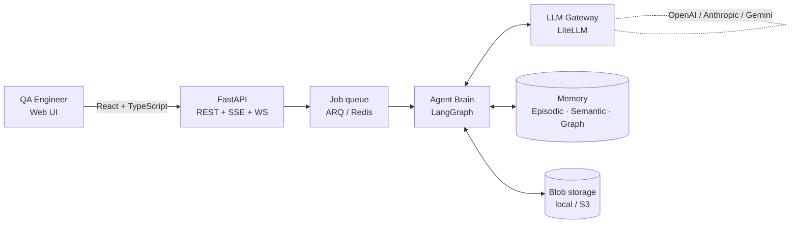
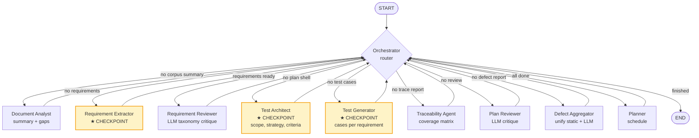
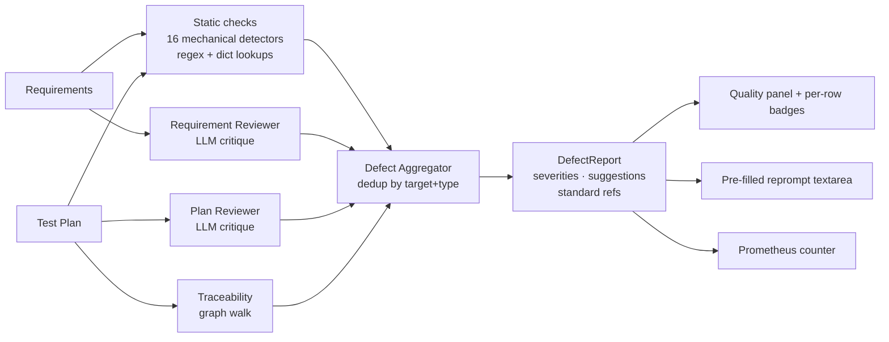

<div align="center">

# AI Test Plan Generator

**A multi-agent platform that turns engineering specifications into ISO-compliant, traceable test plans.**

Built for QA / V&V teams in aerospace, automotive, energy, and medical industries — where every test case must trace to a requirement and every requirement to a source clause.

[](https://www.python.org/)
[](https://fastapi.tiangolo.com/)
[](https://react.dev/)
[](https://www.typescriptlang.org/)
[](https://langchain-ai.github.io/langgraph/)
[](https://www.docker.com/)
[](#)

</div>

---

## Table of contents

1. [What it does](#1-what-it-does)
2. [Why this matters](#2-why-this-matters)
3. [System architecture](#3-system-architecture)
4. [The agent pipeline](#4-the-agent-pipeline)
5. [Interactive mode — human-in-the-loop](#5-interactive-mode--human-in-the-loop)
6. [The quality / defect engine](#6-the-quality--defect-engine)
7. [Tech stack and design choices](#7-tech-stack-and-design-choices)
8. [Quick start](#8-quick-start)
9. [Project structure](#9-project-structure)
10. [Benchmark — measuring what we ship](#10-benchmark--measuring-what-we-ship)
11. [Observability and testing](#11-observability-and-testing)
12. [Visual mockups](#12-visual-mockups)
13. [Roadmap](#13-roadmap)

---

## 1. What it does

You upload engineering specifications (PDF, DOCX, Markdown) to a project. A pipeline of **seven LLM agents** reads them, extracts every normative requirement, drafts a test plan in the **IEEE 829 / Inflectra layout** (scope, strategy, entry/exit criteria, risks), writes one or more test cases per requirement, runs an internal quality review, and builds a coverage matrix and a structured defect report.

You can run this fully autonomously, or in **interactive mode** where the run pauses at three checkpoints so you can accept the agent's output or send free-text feedback before it proceeds.

The output is a printable, exportable, fully-traceable test plan — every test case linked to the requirement it covers, every requirement linked to the source paragraph it came from.

---

## 2. Why this matters

Industrial QA teams cannot use generic LLM tools because they need three things at once:

| Need | How this system solves it |
|---|---|
| **Traceability** — every test case linked back to its source paragraph for audit | A cross-document graph stores `chunk → requirement → test_case` relationships |
| **Provider neutrality** — no vendor lock-in for regulated industries | LiteLLM gateway routes to OpenAI, Anthropic, or Gemini via env vars only |
| **Human oversight** — engineers must validate, not just receive | Interactive mode pauses the pipeline at 3 checkpoints with accept / reprompt controls |

The pipeline doesn't try to replace the engineer. It does the bulk extraction and drafting (which is what kills weeks of QA time), then hands the keys back for review.

---

## 3. System architecture



**Three loosely-coupled layers:**

- **API layer** (FastAPI) handles auth, RBAC, file uploads, REST endpoints, WebSocket chat, and Server-Sent Events for live progress streaming.
- **Job queue** (ARQ on Redis, with an in-process `FakeJobQueue` fallback for dev) decouples slow LLM pipelines from request/response cycles.
- **Brain** is the heart: a LangGraph state machine of cooperating agents sharing a typed `AutonomousState` and pulling context from a three-store memory stack.

The **memory stack** is intentionally pluggable:

| Store | Default | Production option | Used for |
|---|---|---|---|
| Episodic | SQLite | PostgreSQL | Conversation history, audit trail |
| Semantic | In-memory (NumPy) | **Qdrant** | Chunk embeddings, similarity retrieval |
| Cross-document graph | NetworkX | **Neo4j** | Traceability lineage (req → test, doc → req) |

---

## 4. The agent pipeline

Each agent does one job, returns to the orchestrator, and the orchestrator decides what runs next. The orchestrator is mostly procedural (no LLM); it only invokes the LLM to break ties at the end of revision loops, and its output is clamped to `generator | planner | finish` so a confused model can't send it somewhere expensive.



**The seven agents:**

| Agent | LLM tier | What it produces |
|---|---|---|
| **Document Analyst** | fast | Corpus summary, gap detection, content classification |
| **Requirement Extractor** | fast (one call per chunk, parallel) | A list of typed `Requirement` objects with priority, kind, verbatim excerpts |
| **Requirement Reviewer** | balanced | Taxonomy-driven critique: vague modifiers, missing acceptance criteria, compound requirements |
| **Test Architect** | smart | The plan shell: title, intro, objectives, scope, out-of-scope, strategy, entry/exit, risks |
| **Test Generator** | balanced (parallel across requirements) | One or more `TestCase`s per requirement: steps, acceptance criteria, deliverables, KPIs |
| **Traceability Agent** | (deterministic, no LLM) | Coverage matrix; flags weak links and contradictions |
| **Plan Reviewer** | smart | Holistic plan critique with structured findings |
| **Defect Aggregator** | (pure function) | Unified `DefectReport` deduplicated across static + LLM + traceability findings |
| **Planner** | fast | Schedule / sequencing |

LLM routing is tiered (`fast` / `balanced` / `smart`) so cheap operations stay cheap — the extractor running on 200 chunks doesn't use the same model as the architect drafting strategy.

---

## 5. Interactive mode — human-in-the-loop

The differentiator. Industrial customers cannot accept opaque pipelines; engineers want to validate every stage before money is committed to test execution.

When the user ticks **Interactive mode**, the pipeline pauses at three checkpoints — after the extractor, after the architect, and after the generator. At each pause:

1. The run task stores the current `AutonomousState` on the `Job` object.
2. Job status flips to `paused`.
3. The task awaits an `asyncio.Event` that the `/jobs/{id}/resume` endpoint will fire.

The frontend (route: `/projects/{pid}/runs/{jobId}`) polls the job status, detects the pause, fetches `GET /jobs/{id}/checkpoint`, and renders a card showing the agent's output with two actions:

```
┌─────────────────────────────────────────────────────────────────┐
│  Checkpoint: Test plan strategy        ▸ Awaiting your review   │
├─────────────────────────────────────────────────────────────────┤
│  ◢ Aero-Hyd Pump Controller — System Test Plan v1.0             │
│    Scope: System-level qualification of the redesigned ECU…     │
│    Strategy: Two-tier — requirement-based functional + HIL      │
│    Entry: Build under test passes smoke suite (≥ #421)…         │
│                                                                 │
│  ✓ Previous feedback (1): "Drop security reqs, out of scope"    │
│                                                                 │
│  [ Accept and continue ]  [ Send feedback and re-run ]          │
│                           [ Reprompt from detected defects ]    │
└─────────────────────────────────────────────────────────────────┘
```

The user's free-text feedback is appended to the agent's system prompt as a `USER FEEDBACK FROM PREVIOUS ROUND(S)` block, and the agent re-runs. Feedback history accumulates across rounds, so an engineer can refine the output incrementally.

**Caveat:** interactive mode is in-process only (uses the `FakeJobQueue` path). Paused state lives in Python memory; production deployment would need a persistent checkpointer (Redis hash or LangGraph's SqliteSaver).

---

## 6. The quality / defect engine

After the generator and before the planner, a **defect aggregator** unifies findings from three detection layers into a single `DefectReport`. The output is auditable and references industry standards.



**Three detection layers, by cost:**

| Layer | What it catches | Cost |
|---|---|---|
| **Static** | TBD/TBR markers, modality drift, vague modifiers, universal qualifiers, compound requirements, dead trace IDs, missing entry-exit, redundant coverage… | Free (regex / dict) |
| **Requirement Reviewer** | LLM judges atomicity, verifiability, clarity against the taxonomy | 1 LLM call per batch |
| **Plan Reviewer + Traceability** | Holistic LLM critique + graph-derived weak links | 1 LLM call + graph walk |

The **38-entry catalog** in `models/defects.py` defines every defect type with a default severity, a detection-difficulty tag (`mechanical` / `llm` / `domain_expert`), and one or more `standard_refs` (IEEE 830, ISO 29148, ISTQB, DO-178C, IEC 61508).

The aggregator **deduplicates** by `(target_kind, target_id, defect_type)` — same defect caught by three layers collapses to one entry. Higher severity wins; ties go to the more specific detector (`static > traceability > reviewer`). Every emitted defect is also incremented in a Prometheus counter so detector usefulness can be monitored over time.

When a checkpoint pauses, the frontend exposes a **"Reprompt from detected defects"** button that pre-fills the feedback textarea with the top defects formatted as a bullet list — the engineer trims, edits, and sends. This closes the loop properly: the agent gets a structured directive, not a vague "fix it".

---

## 7. Tech stack and design choices

| Layer | Tech | Why |
|---|---|---|
| **LLM gateway** | LiteLLM | One API surface for OpenAI / Anthropic / Gemini. Industrial customers refuse vendor lock-in. |
| **Agent orchestration** | LangGraph | State-machine model fits "one agent per concern, return to supervisor" pattern. Built-in checkpointing for future v2. |
| **Backend** | FastAPI + Pydantic + async | Auto-generated OpenAPI, runtime validation, native async for parallel LLM calls. |
| **Job queue** | ARQ (Redis) | Lighter than Celery, async-native. Falls back to in-process `FakeJobQueue` when Redis is unavailable. |
| **Real-time** | Server-Sent Events + WebSockets | SSE for unidirectional progress streams (cheap on the server). WebSockets only for the chat copilot. |
| **Memory: semantic** | Qdrant | Pure-vector store with metadata filtering. Pluggable behind a `SemanticStore` protocol. |
| **Memory: graph** | Neo4j | Cypher queries make traceability lineage trivial. Pluggable behind a `CrossDocumentGraph` protocol. |
| **Memory: episodic** | SQLite (async via aiosqlite) | Sessions, audit trail. Lightweight default. |
| **Frontend** | React 18 + TypeScript + TanStack Router + React Query + Tailwind | Strong typing across the API boundary (generated from OpenAPI). Industrial-minimalist design system. |
| **PDF export** | jsPDF + jspdf-autotable | Client-side, no rasterisation, selectable text, real Inflectra-style page layout. |
| **Observability** | Prometheus + OpenTelemetry + structlog | Per-defect-type metrics, distributed traces, JSON logs with request-id correlation. |
| **Auth** | JWT (HS256) + Argon2 (passwords) + bcrypt (API keys) | Standard, audited primitives. RBAC enforced at the route level. |
| **Packaging** | Hatchling (Python) + Vite (JS) + Docker + Helm | One image, one chart, deployable to any Kubernetes cluster. |

**Key design decisions worth reading the code for:**

- **Provider-neutral by design.** Swap models without touching application code:
  ```bash
  LLM_MODEL_SMART=claude-opus-4-1-20250805     # or gpt-5, or gemini-2.5-pro
  LLM_MODEL_BALANCED=claude-sonnet-4-5-20250929
  LLM_MODEL_FAST=gemini-2.5-flash
  ```
- **Bounded revision budget** (`max_revision_rounds`) on the orchestrator — the original implementation had an infinite-loop bug where the orchestrator kept asking the LLM "should we revise?" and the LLM kept saying yes; the fix was to clear stale review/trace/defect state inside the generator node so `revision_round` actually increments.
- **Memory protocols, not concrete classes.** `EpisodicStore`, `SemanticStore`, `CrossDocumentGraph` are all `Protocol`s — swapping Qdrant for Pinecone or SQLite for Postgres is a one-file change.
- **Test-doubles for everything that costs money.** `FakeJobQueue`, in-memory semantic store, in-memory graph — the test suite runs the full pipeline without Redis, without LLM calls, without a network.

---

## 8. Quick start

```bash
# 1. Backend
git clone https://github.com/<you>/ai-testplan-generator.git
cd ai-testplan-generator
python -m venv .venv && source .venv/bin/activate
pip install -e .

cp .env.example .env
# Edit .env: set ONE of GEMINI_API_KEY / OPENAI_API_KEY / ANTHROPIC_API_KEY

uvicorn ai_testplan_generator.api.app:create_app --factory --port 8000
```

```bash
# 2. Frontend (in another terminal)
cd frontend
npm install
npm run dev
# UI on http://localhost:5173, talks to API on http://localhost:8000
```

```bash
# 3. (Optional) local Docker stack
cp ops/compose/env.example .env
# Edit .env: set a provider key, JWT_SECRET, and API_CORS_ORIGINS.
docker compose up -d --build
```

Open the UI, sign in, create a project, upload a spec, click **Generate plan**.

### Single-VM Docker deployment

This is the supported demo deployment path for one review server or VM. It
runs the FastAPI API, Redis, worker, and an nginx-served React frontend. The
frontend is exposed on port `8080`; nginx proxies `/api` and `/ws` to the API.

1. Install Docker Engine and the Docker Compose plugin on the VM.
2. Point a DNS name or firewall rule at the VM. Open ports `8080` for the UI
   and, only if you need direct API/debug access, `8000`.
3. Create the production env file:

```bash
cp ops/compose/env.example .env
python - <<'PY'
import secrets
print(secrets.token_urlsafe(48))
PY
```

4. Edit `.env`:

| Variable | Required value |
|---|---|
| `API_DEBUG` | `false` |
| `API_CORS_ORIGINS` | JSON list containing your UI origin, for example `["https://testplans.example.com","http://YOUR_VM_IP:8080"]` |
| `JWT_SECRET` | Paste the generated secret above, or set `JWT_PRIVATE_KEY_PATH` / `JWT_PUBLIC_KEY_PATH` for RS256 |
| `ANTHROPIC_API_KEY`, `OPENAI_API_KEY`, or `GOOGLE_API_KEY` | Set exactly the provider credential you use |
| `LLM_MODEL_SMART`, `LLM_MODEL_BALANCED`, `LLM_MODEL_FAST`, `LLM_MODEL_EMBEDDING` | Models supported by that provider through LiteLLM |
| `APP_DB_PATH` | Keep `data/app.db` for the compose volume unless you mount another path |
| `BLOB_STORE_BACKEND` and `BLOB_STORE_LOCAL_ROOT` | Keep `local` and `./data/blobs` for the compose volume, or configure S3 |
| `REDIS_URL` | Keep `redis://redis:6379/0` in compose |
| `EVENT_BROKER_BACKEND` | Keep `redis` in compose so SSE progress works across processes |

5. Start and verify:

```bash
docker compose up -d --build
docker compose ps
curl -fsS http://localhost:8000/healthz
curl -fsS http://localhost:8000/readyz
```

`/healthz` is a liveness check. `/readyz` is the deployment gate: it checks the
API process, project/user SQLite DB, blob store round-trip, configured memory
backends, and Redis when Redis-backed events/jobs are enabled. It returns `503`
with an `unhealthy` list if a dependency is unavailable.

6. Create the first admin user inside the API container:

```bash
docker compose exec api python scripts/create_admin.py \
  --email admin@example.com \
  --password 'replace-this-password' \
  --name 'Deployment Admin'
```

Then sign in through the UI with that account. If the user already exists, the
script reports it and exits without changing the password.

7. Open the app at `http://YOUR_VM_IP:8080` or your HTTPS reverse-proxy URL.
   Prometheus-format metrics are available at `http://YOUR_VM_IP:8000/metrics`
   when `METRICS_ENABLED=true`.

---

## 9. Project structure

```
src/ai_testplan_generator/
├── models/              Pydantic domain models (TestPlan, Requirement, DefectReport, …)
├── agents/              7 LangGraph agents + state + orchestrator + defect aggregator
├── quality/             16 static defect detectors (regex + dict, no LLM)
├── graphs/              LangGraph topology (autonomous + interactive)
├── pipelines/           Brain factory, autonomous + interactive runners
├── memory/              Episodic / semantic / graph stores with pluggable backends
├── ingestion/           PDF/DOCX parsing, chunking, requirement extraction
├── llm/                 LiteLLM gateway + provider-agnostic ChatMessage abstraction
├── api/                 FastAPI app, routers, schemas, middleware, RBAC
├── jobs/                ARQ task definitions + FakeJobQueue
├── telemetry/           Prometheus metrics + OpenTelemetry tracing + structlog config
└── storage/             Blob store protocol (local FS / S3 / encrypted)

frontend/src/
├── features/
│   ├── plans/           Plans table, plan detail, run workspace, PDF export
│   ├── quality/         Defects panel
│   ├── chat/            Multi-session copilot per project
│   ├── traceability/    Cytoscape graph view + coverage card
│   ├── knowledge/       General KB upload + list
│   ├── projects/        Project dashboard + member management
│   ├── documents/       Upload drawer + table
│   ├── auth/            Login + API keys page
│   └── admin/           Dead-letter queue + cost panel
├── lib/api/             Typed REST client (hand-written + openapi-generated)
└── app/                 Router + layout

tests/                   193 passing + 6 infra-skipped
ops/                     Helm chart, Dockerfile, compose stack
```

---

## 10. Benchmark — measuring what we ship

The project includes a self-contained **evaluation harness** that scores
requirement extraction and defect detection against curated specifications,
because every claim about quality should be falsifiable.

```bash
make eval                        # no LLM keys needed — uses fixtures
make eval-full                   # full pipeline — requires LLM keys
make eval-baseline               # re-capture baseline after intentional changes
```

**Current baseline** (`evals/baseline.json`):

| Benchmark | Defect recall | Notes |
|---|---|---|
| Synthetic aerospace SRS (11 reqs, 6 defects) | **83.3%** | One miss: mixed `should + shall` clause slips past the modality check — known bug surfaced by this very harness. |

The harness is regression-safe (`make eval --fail-on-regression`), tracks
missed defects per benchmark, and writes both Markdown and JSON
reports for CI integration. See [`evals/README.md`](evals/README.md) for the
benchmark schema and how to add new ones.

## 11. Observability and testing

Production-grade visibility was a hard requirement from day one:

- **Prometheus metrics** — request counters, LLM token usage and cost (per project / user / model), per-defect-type detection counts. Scrape at `/metrics`.
- **OpenTelemetry traces** — every agent invocation is a span; cross-process trace propagation through the job queue.
- **Structured logs** — `structlog` JSON output with request-id, trace-id, span-id, user-id correlation.
- **Dead-letter queue** — failed ARQ jobs land in a Redis sorted set, surfaced in the Admin panel for one-click requeue.
- **193 automated tests** (pytest) — unit + integration + API + memory backend round-trips. Strict typecheck on both sides (mypy + tsc).

---

## 12. Visual mockups

[`mockup.html`](mockup.html) — single-file polished mockup of the six main screens (project dashboard, plan generation workspace with interactive checkpoints, plan detail, knowledge base, traceability graph, copilot chat). Open in any browser; no build step.

---

## 13. Roadmap

**Shipped:**
- Full 7-agent autonomous pipeline with bounded revision loops
- Interactive mode with 3 user-gated checkpoints and free-text reprompt
- 38-entry defect taxonomy with 3-layer detection + dedup
- Provider-agnostic LLM routing (OpenAI / Anthropic / Gemini)
- Inflectra-style PDF export (client-side, selectable text)
- Multi-session copilot with episodic memory recall
- Project / member / API-key management
- Prometheus + OpenTelemetry + structlog observability
- Docker / Helm packaging
- 193 automated tests

**Near-term:**
- Persistent checkpointer (Redis / SqliteSaver) so interactive runs survive restarts
- Inline editing of requirements and test cases at checkpoints (today: free-text reprompt only)
- Industry-aware defect tuning (project-level `industry` field threaded into reviewer prompts)
- Defect-catalog drill-down: clicking a defect type opens the catalog entry with examples and standard refs

**Long-term:**
- Full Kubernetes operator for multi-tenant SaaS deployment
- Audit-log export for regulated workflows (DO-178C, ISO 26262 evidence packages)
- VSCode extension for inline requirement extraction during spec authoring

---

<div align="center">

Built with care for engineers who need traceability, not magic.

</div>
