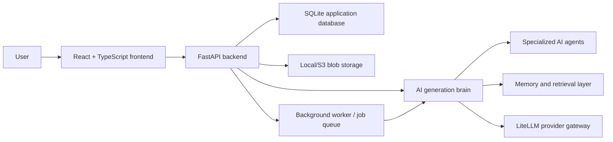

# AI Test Plan Generator

AI Test Plan Generator is a web platform that helps transform technical documents into structured, traceable test plans.

It was built as a project for AI-assisted validation engineering: users upload specifications, extract requirements, generate test plans and test cases, review coverage, and ask a contextual chatbot questions about the project.

## Key Features

- Project workspaces for documents, requirements, test plans, resources, and chat.
- Document upload and ingestion for technical files such as PDF, DOCX, and Markdown.
- AI-assisted requirement extraction from uploaded project documents.
- Multi-agent test plan generation with autonomous and interactive modes.
- Traceability between source documents, extracted requirements, generated test cases, and coverage.
- General knowledge base for reusable testing guidance and project-specific knowledge for document grounding.
- Contextual chatbot with access to project context and generated artifacts.
- PDF export for generated plans.
- Authentication, user settings, provider-key management, and admin views.
- Docker Compose and Helm deployment assets.
- Read the Docs documentation site.

## Architecture Overview



The application is organized around a FastAPI backend, a React frontend, a pluggable AI/memory layer, and optional infrastructure services such as Redis, Qdrant, Neo4j, Prometheus, Grafana, and Jaeger.

## AI Workflow

The generation pipeline is organized into specialized stages:

1. Document analysis
2. Requirement extraction
3. Requirement review
4. Test architecture and strategy
5. Test case generation
6. Traceability and coverage analysis
7. Review and planning

The goal is to keep the generation process inspectable: project documents provide grounding, reusable knowledge provides testing methodology, and traceability links connect the final plan back to the source material.

## Tech Stack

| Layer | Main technologies |
| --- | --- |
| Frontend | React, TypeScript, Vite, TanStack Query, TanStack Router, Tailwind CSS |
| Backend | FastAPI, Pydantic, async Python, SQLite repositories |
| AI | LiteLLM, LangGraph-style orchestration, multi-agent pipeline |
| Ingestion | PDF/DOCX/Markdown loaders, chunking, embeddings |
| Storage | SQLite, local blob storage, optional S3 |
| Retrieval | In-memory semantic store by default, optional Qdrant/Neo4j backends |
| Deployment | Docker, Docker Compose, Helm |
| Observability | Prometheus, OpenTelemetry, structlog |

## Repository Structure

```text
.
├── src/ai_testplan_generator/     Backend source code
├── frontend/                      React frontend
├── tests/                         Backend test suite
├── docs/source/                   Read the Docs documentation source
├── docs/general-knowledge-base/   Reusable testing knowledge documents
├── docs/sample-project-docs/      Sample project documents for testing uploads
├── docs/test-knowledge-base/      Additional test corpus kept for validation
├── ops/                           Compose, Helm, Prometheus, and Grafana assets
├── scripts/                       Utility scripts
├── examples/                      Example pipeline scripts
└── evals/                         Evaluation harness
```

## Quick Start

### 1. Backend

```bash
git clone https://github.com/Kalfa12/AI-TEST-PLAN-GENERATOR-V2.git
cd AI-TEST-PLAN-GENERATOR-V2

python -m venv .venv
source .venv/bin/activate
pip install -e ".[dev]"

cp .env.example .env
```

Edit `.env` and configure the provider keys/models you want to use.

Example local backend command:

```bash
uvicorn ai_testplan_generator.api.app:create_app --factory --reload --port 8000
```

### 2. Frontend

```bash
cd frontend
npm install
npm run dev
```

The development frontend usually runs at:

```text
http://localhost:5173
```

The backend usually runs at:

```text
http://localhost:8000
```

### 3. Create a Local Admin User

```bash
python scripts/create_admin.py
```

Then sign in from the frontend with the configured account.

## Docker Compose

For a full local stack:

```bash
cp .env.example .env
docker compose up --build
```

The composed frontend is exposed on:

```text
http://localhost:8080
```

Useful backend checks:

```bash
curl http://localhost:8000/healthz
curl http://localhost:8000/readyz
```

## Configuration

The main configuration file is:

```text
.env.example
```

Important groups:

- LLM model routing: `LLM_MODEL_SMART`, `LLM_MODEL_BALANCED`, `LLM_MODEL_FAST`, `LLM_MODEL_EMBEDDING`
- Provider keys: `OPENAI_API_KEY`, `ANTHROPIC_API_KEY`, `GOOGLE_API_KEY`, `NVIDIA_API_KEY`
- NVIDIA embeddings: `NVIDIA_BASE_URL`, `NVIDIA_EMBEDDING_BATCH_SIZE`, `NVIDIA_EMBEDDING_TRUNCATE`
- App database: `APP_DB_PATH`
- Upload limits: `MAX_UPLOAD_SIZE_BYTES`, `LARGE_DOC_THRESHOLD_BYTES`
- Auth: `JWT_ALGORITHM`, `JWT_SECRET`, token TTL values
- Runtime services: `REDIS_URL`, `EVENT_BROKER_BACKEND`
- Observability: `METRICS_ENABLED`, `OTEL_ENABLED`, `LOG_FORMAT`

## Documentation

The project includes a Read the Docs-ready documentation site:

```bash
pip install -r docs/requirements.txt
pip install -e .
sphinx-build -b html docs/source docs/_build/html
```

Open locally:

```text
docs/_build/html/index.html
```

Read the Docs configuration:

```text
.readthedocs.yaml
docs/requirements.txt
docs/source/conf.py
```

## Sample Documents

Sample documents are available for testing document upload and generation:

```text
docs/sample-project-docs/
```

Reusable testing knowledge documents are available in:

```text
docs/general-knowledge-base/
```

## Tests

Backend tests:

```bash
pytest
```

Frontend tests:

```bash
cd frontend
npm test
```

Frontend production build:

```bash
cd frontend
npm run build
```

## Notes

- The application depends on external LLM providers for generation.
- Long documents can increase processing time and embedding cost.
- SQLite is suitable for local and project evaluation usage; larger deployments should use a more robust persistence strategy.
- Traceability and generated test plans should be reviewed by a human before formal validation use.

