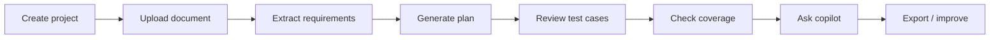
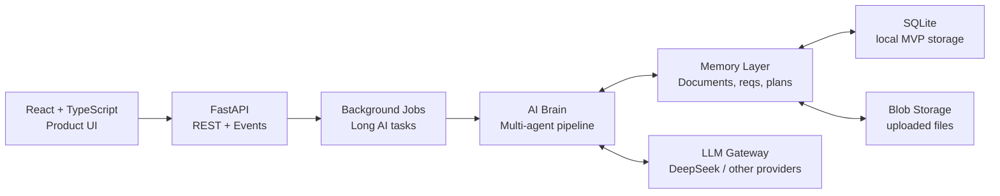
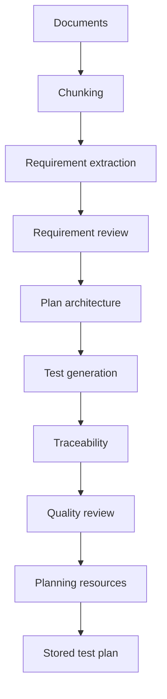
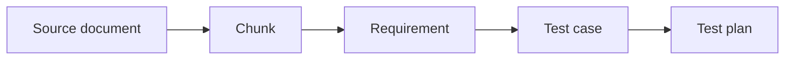

<!-- _class: lead -->

# AI Test Plan Generator

A product-oriented AI platform that turns technical documents into requirements,
traceable test cases, and reviewable test plans.

Semester Project · `<course / school>` · `<team members>` · `<date>`

---

## 1. Product Vision

### From technical documents to engineering test plans

Most test plans start from long specifications, scattered requirements, and manual interpretation.

Our project explores how an AI system can support this workflow while keeping the important engineering constraints:

- **Grounding:** generated output should come from uploaded documents.
- **Traceability:** each test should link back to requirements and sources.
- **Control:** engineers should review and guide the pipeline.
- **Reuse:** project knowledge should remain available through the app.

> The goal is not to replace the test engineer.  
> The goal is to reduce repetitive drafting and make review easier.

---

## 2. The User Workflow

### What the demo shows

Each screen corresponds to a real backend artifact:

Project
Document
Requirement
Test Plan
Test Case
Coverage Matrix
Chat Context

---

## 3. Why This Is More Than A Chatbot

### Generic chatbot

- User pastes a prompt.
- Model generates text.
- No real project state.
- No stored artifacts.
- No reliable coverage.
- Hard to continue later.

### Our platform

- Documents are uploaded and persisted.
- Requirements are extracted and stored.
- Test plans and test cases are reusable.
- Coverage is calculated.
- Chat retrieves project context.
- The workflow can continue over time.

---

## 4. System Architecture

### Full-stack application with an AI brain

The app separates **product workflow**, **backend orchestration**, **AI reasoning**, and **persistence**.

---

## 5. The AI Brain

### Multi-agent pipeline

Instead of one large prompt, the system uses specialized agents:

| Agent | Product role |
|---|---|
| Document Analyst | Understand uploaded documents |
| Requirement Extractor | Extract structured requirements |
| Requirement Reviewer | Detect weak or vague requirements |
| Test Architect | Define plan strategy, scope, criteria, risks |
| Test Generator | Generate executable test cases |
| Traceability Agent | Build requirement-to-test coverage |
| Reviewer | Critique the generated plan |
| Planner | Use resources to schedule work |
| Copilot | Answer contextual project questions |

This makes the AI behavior easier to inspect, debug, and improve.

---

## 6. Generation Pipeline

### Behind the “Generate plan” button

The optional **goal** is passed to the architect agent.

Useful goal:

> Validate authentication and authorization for the v2 API release.

Weak goal:

> Test plan.

If the user leaves it empty, the app uses a default complete-plan objective.

---

## 7. Traceability And Coverage

### The most important engineering feature

The platform stores links between:

- document chunks,
- extracted requirements,
- generated test cases,
- and the final test plan.

This enables:

- coverage percentage,
- uncovered requirements,
- source-aware review,
- and project-aware chat answers.

---

## 8. Project-Aware Copilot

### Chat with context, not just model memory

The copilot can use:

  
Docs

  
uploaded project documents

  
Reqs

  
stored requirements

  
Plan

  
latest generated test plan

It also receives:

- project industry,
- retrieved document chunks,
- test cases,
- coverage matrix,
- recent chat history.

The UI shows a visible **chat context indicator** so the user knows what the chat is grounded on.

---

## 9. Product Screens To Demo

### Recommended live flow

1. **Login** and open the project dashboard.
2. Show **documents** and explain ingestion.
3. Show **requirements** and their role in generation.
4. Open **Generate plan** and explain goal + requirement basis.
5. Open an existing **test plan**.
6. Show **test cases** and detailed steps.
7. Show **coverage** and uncovered requirements.
8. Open **chat** and ask a project-specific question.
9. Mention **resources** for scheduling and follow-up.

Demo question:

> Based on the latest plan, which requirements are not covered and what tests should we add?

---

## 10. Product Features Implemented

| Area | Current capability |
|---|---|
| Project management | Projects, industry context, permanent delete |
| Document ingestion | Upload, chunk, store documents |
| Requirements | Extract, list, select for generation |
| Test plans | Generate, store, inspect, delete, export |
| Traceability | Requirement coverage and gaps |
| Chat | Project-aware copilot with context indicator |
| Planning | Resources and schedule assignments |
| Auth | Login, JWT, API keys, roles groundwork |
| Cost tracking | Token usage and local pricing table |

This gives us a working MVP-style product, not only an AI experiment.

---

## 11. Technical Highlights

### Backend

- FastAPI typed REST API.
- Background jobs for long AI tasks.
- SQLite persistence for local MVP.
- Artifact repositories for plans, requirements, documents.
- Budget and token tracking.

### Frontend

- React + TypeScript.
- Project dashboard workflow.
- Query invalidation / auto-refresh for generated data.
- Interactive run workspace.
- Context-aware chat interface.

---

## 12. Current Limits

### Honest state of the project

The project is functional, but still a prototype/MVP.

Important limitations:

- SQLite is good for local demo, but not ideal for production multi-user usage.
- Long document ingestion can still create timeout-style UX issues.
- Backend chat history exists, but frontend chat session listing is still local-browser based.
- LLM pricing depends on maintaining provider/model price aliases.
- Generated plans still require human review before real engineering use.
- Some UX flows need more polish for a professional deployment.

These are clear next engineering priorities, not hidden assumptions.

---

## 13. What We Learned

### Main engineering lesson

Building an AI product is not just calling an LLM.

The hard parts are:

- getting the right context,
- storing intermediate artifacts,
- making generation auditable,
- showing progress and failures clearly,
- supporting user review,
- and keeping the UI aligned with backend reality.

The most important design choice was treating AI output as **managed project data**, not temporary chat text.

---

## 14. Conclusion

This project demonstrates a complete AI-assisted workflow for test plan generation:

- technical document ingestion,
- requirement extraction,
- multi-agent test plan generation,
- traceability and coverage,
- project-aware copilot,
- and a real product interface.

It is a strong foundation for a professional QA/V&V assistant.

**Next step:** improve robustness, polish the UX, and validate the generated plans with real engineering users.

