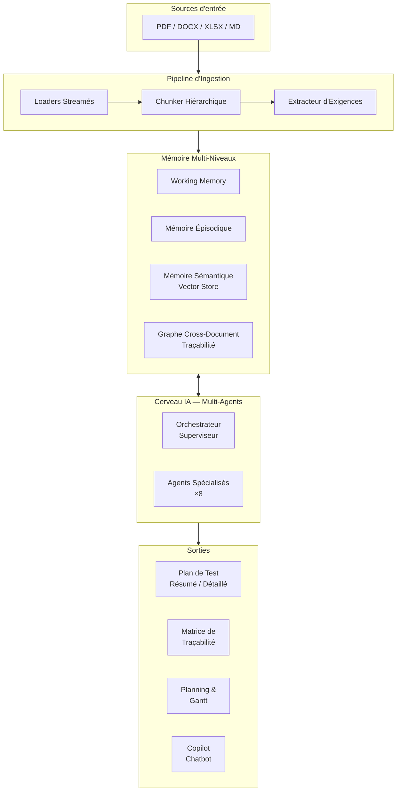
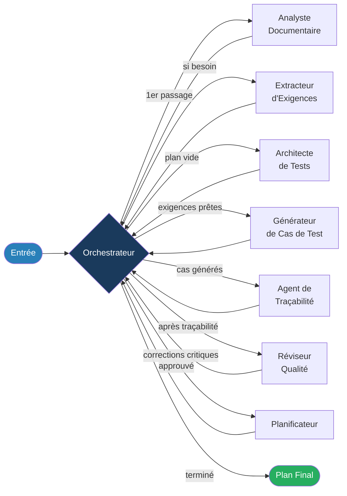
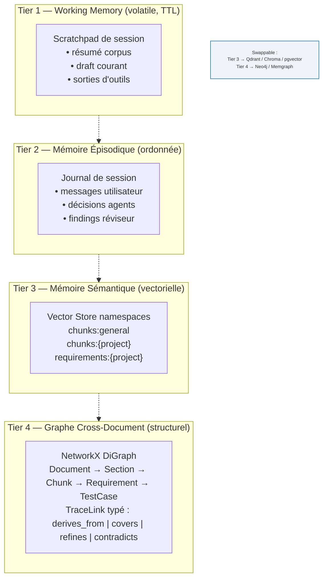
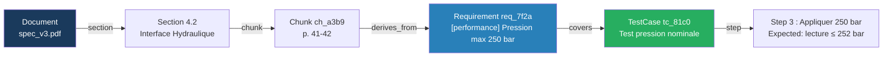
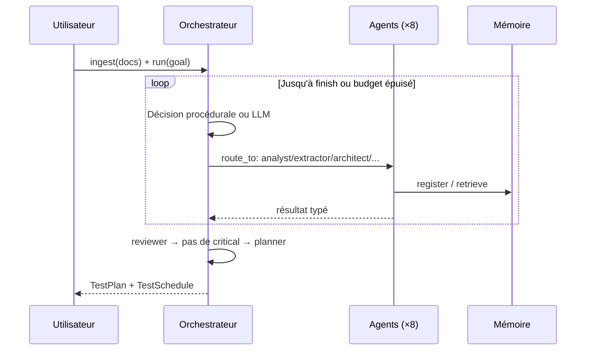
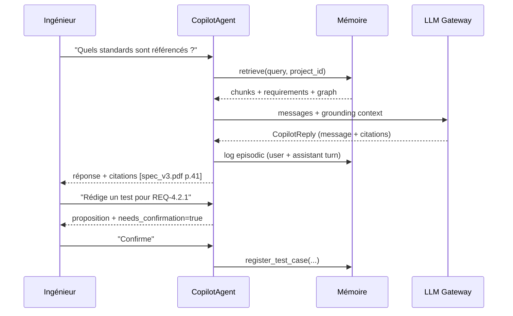
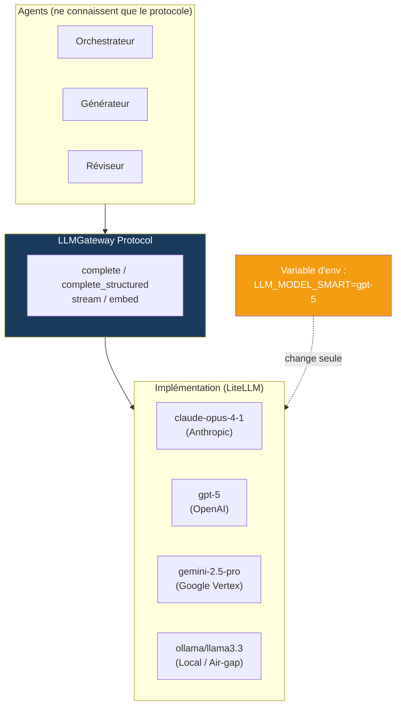
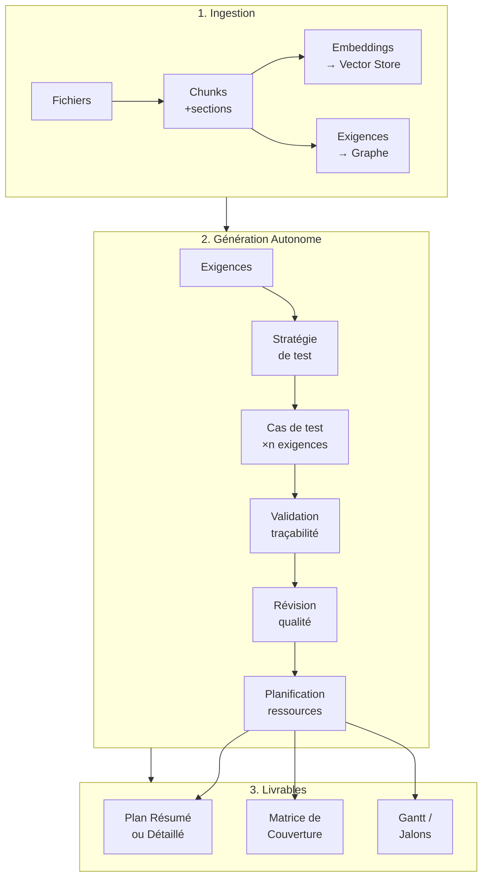
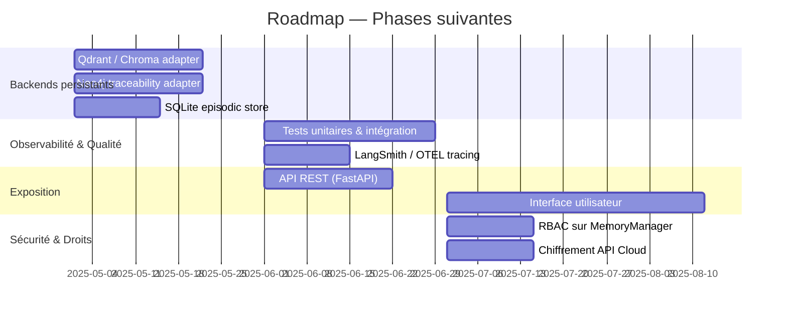

<!-- _class: lead -->

# AI Test Plan Generator
## Génération Intelligente de Plans de Test
### Projet P5 — SIGMAXIS × ENSAM

<br>

> Automatiser la création de plans de test industriels grâce à un pipeline IA multi-agents, traçable et agnostique au fournisseur.

---

## Contexte & Enjeux

> *"La création des plans de test est souvent manuelle, peu capitalisée et fortement dépendante de l'expertise individuelle."*  — Cahier des charges P5

<div class="columns">

**Problèmes actuels**
- Processus 100 % manuel, non capitalisé
- Expertise critique concentrée sur quelques personnes
- Traçabilité faible entre tests et exigences
- Pas de réutilisation inter-projets

**Ce que le système résout**
- Extraction automatique d'exigences depuis tout document
- Génération de plans et instructions testables
- Traceabilité complète (test → chunk → page source)
- Knowledge base réutilisable (général + projet)

</div>

---

## Objectifs Couverts (Cahier des Charges)

| # | Objectif | Statut |
|---|---|---|
| 1 | Générer automatiquement des plans de test | Implémenté |
| 2 | Capitaliser un knowledge base général et projet | Implémenté |
| 3 | Assurer la traçabilité tests ↔ documents sources | Implémenté |
| 4 | Produire des instructions de test exploitables | Implémenté |
| 5 | Deux niveaux de sortie : résumé et détaillé | Implémenté |
| 6 | Mode chatbot pour interaction et validation | Implémenté |
| 7 | Planifier et suivre l'exécution des tests | Implémenté |
| 8 | Agnostique au fournisseur IA (no vendor lock-in) | Implémenté |

---

## Architecture Globale du Système



---

## Le Cerveau IA : Topologie Multi-Agents



---

## Agents Spécialisés — Rôles & Modèles

| Agent | Rôle | Tier LLM |
|---|---|---|
| **Orchestrateur** | Routage, détection de boucle, budget révisions | Fast |
| **Analyste** | Résumé corpus, détection de lacunes | Balanced |
| **Extracteur d'Exigences** | Map-reduce sur chunks, déduplication cosinus | Fast |
| **Architecte de Tests** | Stratégie, scope, critères d'entrée/sortie | **Smart** |
| **Générateur de Cas** | Étapes, critères d'acceptance, équipement | Balanced |
| **Agent Traçabilité** | Validation liens, coverage matrix | Balanced |
| **Réviseur Qualité** | Critique structurée, sévérités critical/major/minor | **Smart** |
| **Planificateur** | Jalons, affectation ressources, Gantt | Balanced |
| **Copilot** | Conversation grounded, mutations confirmées | Balanced |

> Chaque tier (`smart` / `balanced` / `fast`) peut pointer vers n'importe quel fournisseur via une variable d'environnement — aucun code à modifier.

---

## Architecture Mémoire Multi-Niveaux



---

## Pipeline d'Ingestion — Streaming sur Grands Documents

```mermaid
flowchart LR
    subgraph IN["Fichier source (PDF/DOCX/XLSX/MD)"]
        F[10 000+ pages]
    end

    subgraph LOAD["Loader (streaming)"]
        L1[PdfLoader\npypdf]
        L2[DocxLoader\npython-docx]
        L3[XlsxLoader\nopenpyxl read_only]
        L4[MarkdownLoader]
    end

    subgraph BLOCK["RawBlock stream\n(lazy iterator — O(1 page))"]
        B["heading | prose\ntable | list_item\ncode | formula"]
    end

    subgraph CHUNK["Chunker Hiérarchique"]
        H["Pass 1 : Arbre de sections\n(numéros, titres, niveaux)"]
        T["Pass 2 : Packing token-bounded\n(prose) + blocs atomiques\n(tables, formules)"]
    end

    subgraph OUT["Sortie"]
        S[Sections avec offsets]
        C[Chunks avec back-pointers]
        E[Exigences extraites\n(LLM map-reduce)]
    end

    F --> LOAD --> BLOCK --> H --> T --> OUT
    style F fill:#e8f4f8
```

> **Clé de scalabilité :** le loader est un itérateur paresseux. Le chunker n'accumule jamais plus qu'une page en mémoire.

---

## Traçabilité — La Colonne Vertébrale du Système



**Chaque artefact est résolvable jusqu'au byte source :**
- `tc_81c0` couvre → `req_7f2a` dérive de → `ch_a3b9` → section 4.2 → page 41

---

## Mode Autonome (Fire-and-Forget)



**Résultat :** plan complet, révisé, planifié — sans interaction humaine.

---

## Mode Interactif (Copilot Chatbot)



---

## Agnostisme Fournisseur — Zéro Vendor Lock-in



> Même logique pour le vector store : `SemanticStore` Protocol → InMemory | Qdrant | Chroma | pgvector.

---

## Stack Technique

<div class="columns">

**Orchestration & IA**
- **LangGraph** — graphe d'agents avec état, checkpointing, interrupts
- **LiteLLM** — gateway universel 100+ providers
- **Pydantic v2** — modèles stricts, sorties structurées
- **Structured Output** — JSON Schema enforced sur chaque agent

**Ingestion & Traitement**
- **pypdf, python-docx, openpyxl** — loaders natifs streaming
- **NetworkX** — graphe de traçabilité (Neo4j-ready)
- **NumPy** — vector store in-memory (Qdrant-ready)

</div>

**Qualité & Opérationnel**
- `structlog` — observabilité structurée sur chaque agent
- `tenacity` — retries exponentiels sur les appels LLM
- `mypy` strict + `ruff` — lint & typage statique
- `hatchling` — packaging PEP 517

---

## Structure du Code

```
src/ai_testplan_generator/
├── config.py                 ← Settings (pydantic-settings, env-driven)
├── models/                   ← 5 modèles Pydantic partagés
├── llm/                      ← Gateway Protocol + LiteLLM impl
├── ingestion/                ← Loaders, Chunker, Extractor, Pipeline
├── memory/                   ← 4 tiers + MemoryManager
├── knowledge/                ← General KB + Project KB
├── prompts/                  ← Bibliothèque de prompts centralisée
├── agents/                   ← 9 agents + State + Base
├── graphs/                   ← LangGraph autonomous + interactive
└── pipelines/                ← Brain (racine), AutonomousPipeline, InteractivePipeline
examples/
├── run_autonomous.py         ← Demo fire-and-forget
└── run_interactive.py        ← Demo copilot REPL
```

**~4 200 lignes** · **40 modules** · **0 erreur de compilation**

---

## Flux de Données Complet



---

## Avancement du Projet

| Module | Statut | Commentaire |
|---|---|---|
| Ingestion PDF/DOCX/XLSX/MD | Complet | Streaming, 10k+ pages |
| Chunker hiérarchique | Complet | Overlap, atomique tables |
| Gateway LLM agnostique | Complet | LiteLLM + 3 tiers |
| Mémoire 4 niveaux | Complet | Interfaces + impl. ref. |
| 9 agents spécialisés | Complet | Typés, structurés |
| Graphe LangGraph × 2 modes | Complet | Autonome + Interactif |
| Pipeline public (Brain) | Complet | Racine de composition |
| Backends persistants (prod) | Prochaine étape | Qdrant, Neo4j |
| API REST / Frontend | Hors scope actuel | Phase suivante |
| Tests unitaires | Prochaine étape | Mocks déjà prévus |

---

## Prochaines Étapes



---

<!-- _class: lead -->

# Merci

<br>

**Périmètre livré à ce stade**

Un pipeline IA complet, provider-agnostic, multi-agents, avec
ingestion enterprise-scale, mémoire 4 niveaux et traçabilité complète.

**Deux commandes pour démarrer :**
```bash
pip install -e .
python examples/run_autonomous.py spec.pdf norme.docx
```

<br>

> Questions ?
